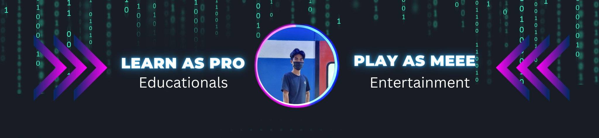

<h1 align="center">
  Hi 💤, I'm VP (Vitou Pro) 😴
  

  <table align="center">
    <tr border: none;>
      <td></td>
      <td></td>
    </tr>
</table>
</h1>

<h3 align="center">zzzz | Khmer OCR | Text2Speech | Speech2Text | Voice Conversion | zzzz </h3>

- 🔭 I’m currently working on AI Project (ASR, TTS, Face, Voice Cloning, NLP, Image Processing ...)🌱

- 📝 My Tools: Python, Pytorch, Nginx, Caddy, Docker, Cloudflare, Portainer, Flask Fast API, Termius, mkdos, ...

- 👯 I’m looking to collaborate on **AI Project**

- 💬 Reach out me through telegram: 0964060587

- 📫 Experience: Create Content, Web Development, Dasktop APP Development, AI Project
  
- ⚡ Fun fact **update readme everyday**

 

<!-- Activity Graph card -->
 
 
<h2>Activity Graph</h2>

- 💬 My blog post: [soyvitou.bongrean.com](https://soyvitou.bongrean.com/)

